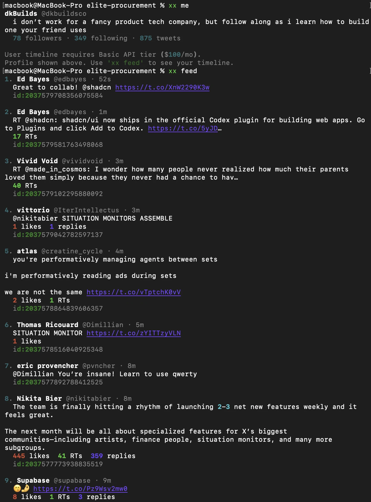

<div align="center">

# xx

**Twitter/X from the terminal. Stay up to date without the doom scroll.**

</div>

---

## Why

I use X to stay current on AI/tech/software/business. This includes new tools, frameworks, techniques, and research I find helpful and interesting as someone who works in the space. The space moves so fast now that it's important to keep up. But it's even more important to protect your focus.

X on the browser is very addicting. I'm too weak at times to resist the scroll (especially on the toilet).

**Good ideas persist over time.** I don't need to check X every 30 minutes, let alone everyday. I can increase my signal-to-noise ratio dramatically by consuming intentionally.

**The CLI strips away the addicting stuff.** I've found the CLI to be helpful with focusin only on the task at hand. It's even gone so far as to almost entirely replaced my use of ChatGPT in the browser at this point. The CLI is a great question-answer machine.

I've got questions, want to stay up to date and interact with other ideas, without losing my focus. To me, that means using X without X, "not X".

---

## Install

```bash
git clone https://github.com/declankra/xxcli.git
cd xxcli
pip install -e .
```

> Requires **Python 3.10+** and a Twitter/X API key with OAuth 1.0a User Context.

<details>
<summary><strong>API credentials</strong></summary>

<br>

Set these environment variables (add to your `.zshrc` / `.bashrc`):

```bash
export X_API_KEY="your-api-key"
export X_API_SECRET="your-api-secret"
export X_ACCESS_TOKEN="your-access-token"
export X_ACCESS_TOKEN_SECRET="your-access-token-secret"
```

You need a [Twitter Developer account](https://developer.twitter.com/) with at least Free tier access. The Free tier supports posting and reading your home timeline.

</details>

---

## Usage

| Command | Example | Description |
|---|---|---|
| `xx feed` | `xx feed -n 50` | Read your home timeline (default: 20) |
| `xx post` | `xx post "shipping v0.1" screenshot.png` | Post a tweet, optionally with an image |
| `xx reply` | `xx reply 123456789 "great point"` | Reply by tweet ID or URL |
| `xx like` | `xx like 123456789` | Like by tweet ID or URL |
| `xx me` | `xx me -n 20` | See your own tweets (default: 10) |

---

## UI/UX Progression

Tracking the interface over time as the product evolves.

<details>
<summary><strong>2026-03-27</strong></summary>

<br>

The first usable UX isn't valuable: authenticate, run `xx feed`, and read your timeline in the terminal. At this point the product is basically a focused feed reader that doens't finish it's sentences.



</details>

---

## What's next

Things I'm building towards:

- **Interacting with ideas** — How can I interact with the ideas, in a way that is immediately practical and actionable, based on how I currently work?

  > "sees new thing -> ah yeah this can be useful -> prompt codex in repo 'how can this be useful?' -> debate if its actually useful"
  >
  > — [dkBuilds (@dkbuildsco), March 2, 2026](https://x.com/dkbuildsco/status/2028551284853190733)

- **AI-powered relevance filtering** — filter the tweets in my feed most applicable to what my goals are and what I'm working on

- **Agent-native** — what does a claude code/codex terminal agent need (skills, deterministic tools, user context...) so that the user (myself) could do the above?

- **User vs agent UX** — what purpose does me using CLI commands vs agent using them on my behalf? what UI/UX makes most sense given goals of applying the ideas fast and interacting with them (asking follow-ups, "how would this work with what im doing with Y?", etc.)

---

## License

MIT - do whatever
